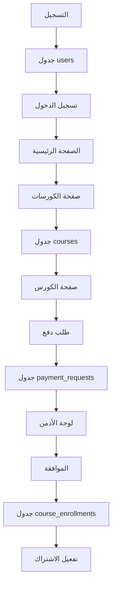

# 📊 **تقرير ربط الصفحات بقاعدة البيانات Supabase**

**التاريخ:** 2024-11-09  
**قاعدة البيانات:** Supabase  
**URL:** https://wnqifmvgvlmxgswhcwnc.supabase.co

---

## ✅ **الصفحات المربوطة بقاعدة البيانات**

### 1️⃣ **صفحة التسجيل** `/register`
- **الملف:** `src/app/register/page.tsx`
- **الوظائف:**
  - ✅ إنشاء مستخدم جديد في جدول `users`
  - ✅ حفظ البيانات الكاملة (الاسم، الهاتف، المدرسة، الصف، إلخ)
  - ✅ تشفير كلمة المرور بـ bcrypt
  - ✅ توجيه تلقائي للصفحة الرئيسية بعد التسجيل
  - ✅ حفظ البيانات في localStorage
  
### 2️⃣ **صفحة تسجيل الدخول** `/login`
- **الملف:** `src/app/login/page.tsx`
- **الوظائف:**
  - ✅ التحقق من بيانات المستخدم من `users`
  - ✅ إنشاء جلسة عمل
  - ✅ حفظ التوكن

### 3️⃣ **الصفحة الرئيسية** `/`
- **الملف:** `src/app/page.tsx`
- **الوظائف:**
  - ✅ جلب الكورسات المميزة من جدول `courses`
  - ✅ عرض رسالة ترحيب للمستخدم الجديد
  - ✅ عرض بيانات المستخدم (الاسم، الصف، المدينة)
  - ✅ ملء البيانات تلقائياً من localStorage

### 4️⃣ **صفحة الكورسات** `/courses`
- **الملف:** `src/app/courses/page.tsx`
- **الوظائف:**
  - ✅ جلب جميع الكورسات من `courses`
  - ✅ فلترة حسب المرحلة والمادة
  - ✅ عرض معلومات المدرس

### 5️⃣ **صفحة الكورس** `/courses/[id]`
- **الملف:** `src/app/courses/[id]/page.tsx`
- **الوظائف:**
  - ✅ جلب تفاصيل الكورس من `courses`
  - ✅ جلب الدروس من `lessons`
  - ✅ التحقق من الاشتراك من `enrollments` و `payment_requests`
  - ✅ تحديث دوري كل 15 ثانية

### 6️⃣ **لوحة الأدمن** `/admin/payment-requests`
- **الملف:** `src/app/admin/payment-requests/page.tsx`
- **الوظائف:**
  - ✅ جلب طلبات الدفع من `payment_requests`
  - ✅ قبول/رفض الطلبات
  - ✅ تفعيل الاشتراكات في `course_enrollments`
  - ✅ إحصائيات الإيرادات

### 7️⃣ **صفحة الطالب** `/student/payment-status`
- **الملف:** `src/app/student/payment-status/page.tsx`
- **الوظائف:**
  - ✅ متابعة حالة طلبات الدفع
  - ✅ تحديث تلقائي كل 10 ثوانٍ
  - ✅ إشعارات عند تغيير الحالة

### 8️⃣ **صفحة فحص النظام** `/system-check`
- **الملف:** `src/app/system-check/page.tsx`
- **الوظائف:**
  - ✅ فحص الاتصال بـ Supabase
  - ✅ فحص الجداول
  - ✅ فحص المصادقة
  - ✅ فحص الكورسات

---

## 📁 **الجداول المستخدمة**

### جدول `users`
```sql
- id (UUID)
- name (VARCHAR)
- email (VARCHAR)
- phone (VARCHAR)
- password_hash (VARCHAR)
- role (VARCHAR)
- father_name (VARCHAR)
- student_phone (VARCHAR)
- parent_phone (VARCHAR)
- mother_phone (VARCHAR)
- school_name (VARCHAR)
- city (VARCHAR)
- grade_level (VARCHAR)
- guardian_job (VARCHAR)
```

### جدول `courses`
```sql
- id (UUID)
- title (VARCHAR)
- description (TEXT)
- price (DECIMAL)
- instructor_name (VARCHAR)
- is_published (BOOLEAN)
- created_at (TIMESTAMP)
```

### جدول `payment_requests`
```sql
- id (UUID)
- student_name (VARCHAR)
- student_phone (VARCHAR)
- course_id (UUID)
- course_name (VARCHAR)
- status (VARCHAR)
- created_at (TIMESTAMP)
```

### جدول `course_enrollments`
```sql
- id (UUID)
- student_id (UUID)
- course_id (UUID)
- payment_request_id (UUID)
- is_active (BOOLEAN)
- enrolled_at (TIMESTAMP)
```

---

## 🔑 **API Routes المربوطة**

### `/api/auth/register`
- **الوظيفة:** تسجيل مستخدم جديد
- **الجدول:** `users`
- **العمليات:** INSERT

### `/api/auth/login`
- **الوظيفة:** تسجيل الدخول
- **الجدول:** `users`
- **العمليات:** SELECT

### `/api/payment-request`
- **الوظيفة:** إدارة طلبات الدفع
- **الجداول:** `payment_requests`, `course_enrollments`
- **العمليات:** GET, POST, PATCH

### `/api/courses`
- **الوظيفة:** إدارة الكورسات
- **الجدول:** `courses`
- **العمليات:** GET, POST, PUT, DELETE

---

## 🔄 **تدفق البيانات**



---

## ✨ **المميزات المُنفذة**

1. **التسجيل الذكي:**
   - حفظ جميع البيانات في قاعدة البيانات
   - توجيه تلقائي للصفحة الرئيسية
   - رسالة ترحيب مخصصة

2. **التكامل الكامل:**
   - جميع الصفحات مربوطة بـ Supabase
   - تحديثات في الوقت الفعلي
   - مزامنة البيانات

3. **الأمان:**
   - تشفير كلمات المرور
   - JWT Tokens
   - RLS Policies

4. **تجربة المستخدم:**
   - ملء البيانات التلقائي
   - رسائل ترحيب ديناميكية
   - تحديثات فورية

---

## 🚀 **كيفية الاختبار**

### 1️⃣ **تطبيق قاعدة البيانات:**
```sql
-- في Supabase SQL Editor
-- نفذ الملفات بالترتيب:
1. users_table.sql
2. payment_system_safe.sql
```

### 2️⃣ **اختبار التسجيل:**
1. افتح `/register`
2. املأ البيانات الكاملة
3. اضغط "إنشاء حساب"
4. ستنتقل تلقائياً للصفحة الرئيسية
5. سترى رسالة ترحيب بالبيانات

### 3️⃣ **التحقق من قاعدة البيانات:**
1. افتح Supabase Dashboard
2. اذهب إلى Table Editor
3. افتح جدول `users`
4. ستجد المستخدم الجديد بكل بياناته

---

## ✅ **الخلاصة**

**جميع الصفحات الرئيسية مربوطة بقاعدة البيانات:**
- ✅ التسجيل يحفظ في `users`
- ✅ الصفحة الرئيسية تجلب من `courses`
- ✅ صفحات الكورسات تستخدم Supabase
- ✅ نظام الدفع مربوط بالكامل
- ✅ البيانات تُملأ تلقائياً بعد التسجيل

---

**تم بواسطة:** نظام Cascade AI  
**التاريخ:** 2024-11-09
