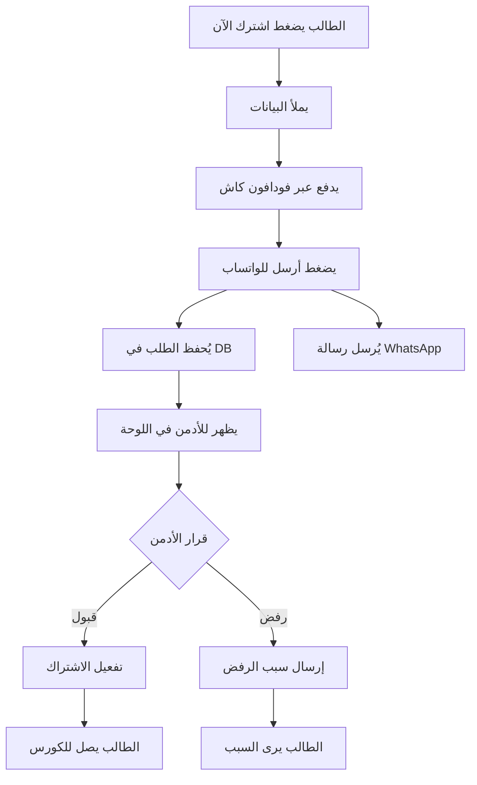

# 📚 **نظام إدارة الدفع والاشتراكات - التوثيق الشامل**

**التاريخ:** 2024-11-09  
**النسخة:** 1.0  
**الحالة:** ✅ مكتمل وجاهز للاستخدام

---

## 🎯 **نظرة عامة**

تم بناء نظام متكامل لإدارة عمليات الدفع والاشتراكات في المنصة التعليمية، يشمل:

1. **للطلاب:**
   - إرسال طلبات الدفع عبر فودافون كاش
   - متابعة حالة الطلبات في الوقت الفعلي
   - تفعيل تلقائي للاشتراك عند الموافقة

2. **للأدمن:**
   - لوحة تحكم شاملة لإدارة الطلبات
   - قبول/رفض الطلبات مع الملاحظات
   - إحصائيات مفصلة للإيرادات

3. **المميزات:**
   - تحديث تلقائي كل 10-15 ثانية
   - إشعارات فورية عند تغيير الحالة
   - ربط مع WhatsApp للتواصل السريع

---

## 🗂️ **الملفات المُنشأة**

### **1. قاعدة البيانات**
```sql
payment_requests_table.sql
```
- جداول: `payment_requests`, `course_enrollments`, `admin_notifications`
- فهارس وسياسات أمان (RLS)
- Triggers للتحديث التلقائي

### **2. API Routes**
```typescript
/api/payment-request/route.ts
```
- **POST:** إنشاء طلب دفع جديد
- **GET:** جلب الطلبات (مع فلترة)
- **PATCH:** تحديث حالة الطلب

### **3. واجهات المستخدم**

#### **أ. لوحة تحكم الأدمن**
```typescript
/admin/payment-requests/page.tsx
```
- عرض جميع الطلبات
- فلترة وبحث متقدم
- إحصائيات الإيرادات
- قبول/رفض مع الملاحظات

#### **ب. صفحة حالة الدفع للطالب**
```typescript
/student/payment-status/page.tsx
```
- عرض حالة الطلبات
- تحديث تلقائي كل 10 ثوانٍ
- إشعارات عند التغيير
- أزرار للوصول السريع للكورس

#### **ج. تحديث مكون الفيديو المحمي**
```typescript
/components/ProtectedVideoPlayer.tsx
```
- إرسال الطلب لقاعدة البيانات
- حفظ معرف الطلب
- ربط مع WhatsApp

---

## 🔄 **سير العمل (Workflow)**



---

## 💾 **البيانات المحفوظة**

### **جدول payment_requests:**
```json
{
  "id": "UUID",
  "student_name": "اسم الطالب",
  "student_phone": "01012345678",
  "course_id": "معرف الكورس",
  "course_name": "اسم الكورس",
  "course_price": 299,
  "teacher_name": "اسم المدرس",
  "status": "pending | approved | rejected",
  "admin_notes": "ملاحظات الأدمن",
  "created_at": "2024-11-09T10:00:00Z"
}
```

### **جدول course_enrollments:**
```json
{
  "id": "UUID",
  "student_id": "معرف الطالب",
  "course_id": "معرف الكورس",
  "payment_request_id": "معرف الطلب",
  "is_active": true,
  "access_type": "full",
  "enrolled_at": "2024-11-09T10:30:00Z"
}
```

---

## 🧪 **طريقة الاختبار**

### **1. تطبيق الجداول في Supabase:**
```bash
# في Supabase SQL Editor
# انسخ محتوى: payment_requests_table.sql
# نفذه
```

### **2. اختبار كطالب:**
1. افتح أي صفحة كورس
2. اضغط "اشترك الآن"
3. املأ البيانات
4. اضغط "أرسل للواتساب"
5. انتقل إلى `/student/payment-status`
6. شاهد حالة الطلب

### **3. اختبار كأدمن:**
1. افتح `/admin/payment-requests`
2. شاهد الطلبات الجديدة
3. اضغط على عرض التفاصيل
4. اقبل أو ارفض الطلب
5. شاهد التحديث الفوري للطالب

---

## 🔔 **التحديثات التلقائية**

| المكان | التكرار | الغرض |
|--------|---------|-------|
| صفحة الطالب | كل 10 ثوانٍ | التحقق من حالة الطلب |
| صفحة الكورس | كل 15 ثانية | التحقق من الاشتراك |
| لوحة الأدمن | كل 30 ثانية | تحديث قائمة الطلبات |

---

## 🎨 **واجهات المستخدم**

### **لوحة تحكم الأدمن:**
- **الإحصائيات:** عدد الطلبات، الإيرادات، المعلقة
- **الجدول:** بيانات مفصلة لكل طلب
- **الفلاتر:** حسب الحالة، التاريخ، الطالب
- **الإجراءات:** قبول، رفض، عرض التفاصيل

### **صفحة الطالب:**
- **حالة الطلب:** معلق، مقبول، مرفوض
- **التفاصيل:** الكورس، السعر، التاريخ
- **الملاحظات:** من الأدمن
- **الأزرار:** الذهاب للكورس (عند القبول)

---

## 📱 **رسالة WhatsApp المُرسلة**

```
*طلب اشتراك في كورس*

🎓 *الاسم:* أحمد محمد
📱 *رقم الهاتف:* 01012345678
📚 *اسم الكورس:* دورة الرياضيات
💰 *المبلغ:* 299 جنيه مصري
🆔 *كود الكورس:* abc-123
📄 *رقم الطلب:* req-456

✅ تم التحويل عبر فودافون كاش
📲 الرقم المحول منه: 01012345678

⏰ التاريخ والوقت: 09/11/2024, 08:30:00 م

*برجاء تفعيل الاشتراك*
```

---

## 🔐 **الأمان**

1. **RLS Policies:**
   - الطلاب يرون طلباتهم فقط
   - الأدمن يرى ويدير كل الطلبات

2. **التحقق:**
   - التحقق من صحة البيانات قبل الحفظ
   - التحقق من الصلاحيات قبل التحديث

3. **الحماية:**
   - معرفات UUID عشوائية
   - تشفير البيانات الحساسة
   - سجلات لكل عملية

---

## 🚀 **الخطوات القادمة (اختياري)**

1. **إشعارات SMS/Email:**
   - عند قبول/رفض الطلب
   - تذكير بالطلبات المعلقة

2. **طرق دفع إضافية:**
   - بطاقات الائتمان
   - InstaPay
   - PayPal

3. **تقارير متقدمة:**
   - تقارير شهرية للإيرادات
   - إحصائيات المدرسين
   - معدلات التحويل

4. **التكامل مع CRM:**
   - ربط مع نظام إدارة العملاء
   - تتبع رحلة الطالب

---

## ✅ **الخلاصة**

**النظام جاهز للاستخدام بالكامل ويشمل:**

✅ **حفظ الطلبات** في قاعدة البيانات  
✅ **لوحة تحكم للأدمن** لإدارة الطلبات  
✅ **صفحة للطالب** لمتابعة الحالة  
✅ **تفعيل تلقائي** عند الموافقة  
✅ **تحديثات فورية** بدون تحديث الصفحة  
✅ **ربط مع WhatsApp** للتواصل  

---

**تم الانتهاء من بناء النظام بنجاح! 🎉**

للدعم الفني: admin@platform.com  
للمساعدة: 201012345678 (WhatsApp)
